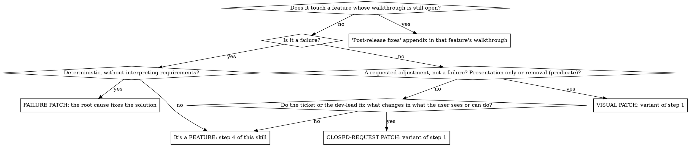

# sdd-propose

## Overview

The single entry for a change: it reads the project, classifies the change into a lane and writes what comes before implementing (spec and plan, or the patch's opening). This project works with **Spec-Driven Development**: the spec is the source of truth, the code is output. The `superpowers:*` skills are used as **process**; artifacts (folders, names, document structure) follow the kit's convention, which overrides superpowers' defaults. Write everything the user reads in the language of their message, skill announcements included.

**Golden rule:** artifacts live ONLY in `.docs/sdd/specs/<task-folder>/`. Never create `docs/superpowers/` or leave loose plans.

**Breaking the letter of the gates is breaking their spirit.**

## ⛔ Gate 1 — On invocation: load context and STOP

Invoking this skill does NOT mean "run the whole SDD now". It is step 0: prime the SDD context. Two paths, depending on how the invocation arrives:

- **Alone** (`/sdd-propose` with no statement, or the skill triggered before the user says what they want): your only goal this turn is to **read the SDD context and STOP** until they state the change — unless the branch is `feature/<id>` and `<id>` has a pending roadmap row: then the statement comes from that row and you go on to step 2, which takes it as the statement. Don't spend a turn asking «which task?» when the branch already says it (`tests/control-profiles-red.md`, E1).
- **With a statement** (`/sdd-propose <change>`, or the change in the same message that triggers the skill): read the SDD context and **continue** to step 2 without stopping to ask what to do — the statement is there.

**Before the statement, DO NOT** explore the feature's code (grep / `semble` / Read of the implementation). The SDD context is the **docs**, not the code — and you don't know the task yet. With the statement, step 2 looks at the code only to classify.

| Rationalization | Reality |
| --- | --- |
| "I need to explore the code to have context" | The SDD context is the docs (constitution, architecture…). Exploring code before the statement is premature and burns tokens on assumptions. |
| "I'll prepare something meanwhile" | There is no "meanwhile". Context → stop. |

## Checklist per change (one todo per step)

**Phase notice** — every time you move from one step to the next, your message opens with a plain line: `Ahora: <qué haces, dicho sin número de paso>. Queda: <lo que falta hasta la próxima parada del usuario>, ~<minutos>`, and `, ~<dólares>` if the step launches subagents or subjects. A counter («van 7 de 15») or a step number alone doesn't tell the user where they are (`tests/fewer-stops-red.md`, s1). In a feature or a spike, the notice that leaves step 2 is the announcement, with these lines under it:

```text
Carril: feature, modo full · Perfil: delegate, del proyecto (sdd-kit.json)
Ignoro de sdd-kit.local.json: merge.push (es del equipo, va en sdd-kit.json)
Si te vas a ausentar: «apruebo la spec por delegación, nos vemos en la validación»
```

1. **Context** — read `.docs/sdd/`: `constitution.md`, `mission.md`, `tech-stack.md`, `roadmap.md` (+ `architecture.md` and `capabilities/` if they exist — `capabilities/<capability>.md` is the living truth of behavior). Before opening any capability, run `node "${CLAUDE_PLUGIN_ROOT}/cli/bin/sdd.js" capability index --path .docs/sdd` and read only those that, by their purpose, the change will touch: the file name doesn't say where a rule lives (`tests/capabilities-index-red.md`, s).
2. **Classify** — read only the code the request touches, enough to classify (reproduce a reported failure, find the file a setting lives in): designing the solution is step 4. Exits: a request that only changes planning —adding or reordering roadmap rows, preparing a release, or a client change to the definition of an already split proposal— without asking to do anything yet → NOT a change, use `sdd-roadmap`: opening a spec for it rewrites what was planned (`tests/sdd-roadmap-green.md`, p10-3); a feasibility question whose output is an **answer** in the chat ("can we…?", "try it quickly") → NOT a change: `sdd-consult` probes it without artifacts. Everything else is a change, and goes to one of five lanes:
   - **spike** — an investigation that must leave its evidence: a table of measurements, a measured threshold («¿aguanta `libres` 1.000 reservas? quiero la tabla de medidas»). Until its own shape exists, it runs as a full feature.
   - **config** — a change that doesn't alter what the product's user sees or can do: dependencies, CI, environment variables, settings, a typo, a rename or a format outside visible text. A typo in a screen label is visible text given literally: patch. See [Config lane](#config-lane).
   - **patch** — a small change whose **solution is already fixed**: a **deterministic** failure (the root cause fixes it), a **presentation-only adjustment or removal** (the request fixes it) or a **closed request** that says what changes in what the user sees or can do (the ticket or the dev-lead fixes it). Check it with [Is it really a patch?](#is-it-really-a-patch); it goes on in `sdd-start-patch` (folder prefixed `patch-`, never `feature-`), which verifies an adjustment with a screenshot. «It's layout with design judgment» doesn't make it a feature (`tests/visual-patch-red.md`, v2), nor «add an event» with the solution in the ticket (`tests/patch-lane-red.md`, p1 and p2). If you'd have to fix the text, the place or the rule, it's a feature even if small.
   - **lite** — a bounded change that meets the predicate (conditions in [modo-lite.md](../sdd-start-feature/references/modo-lite.md)).
   - **feature** — everything else, in full mode. A request with parts of several lanes goes by its heaviest part.

   **Lane in the request.** «patch: …», «lite: …» or «config: …» that your investigation confirms is not asked again. If you see a heavier lane, ask, with the heavier one recommended and what you'd have to decide in it (`tests/sdd-propose-0160-red.md`, a3 and a4). A request that names a heavier lane than the one you see keeps it: you may offer the lighter one in a question, never move down on your own.

   **Ceremony follows the lane.** Read `.docs/sdd/sdd-kit.local.json` even if it doesn't show when listing the folder (`tests/sdd-config-red.md`, c2); the current profile comes from the feature, that file, the release or the project, and you say which level. If the branch is `feature/<id>` and `<id>` has a pending roadmap row, that row is the statement.
   - **feature and spike announce and go on**, with no confirmation question (`tests/sdd-propose-0160-red.md`, a1). Before invoking `superpowers:brainstorming`, your message opens with the announcement, in this form: «Carril: feature, modo full · Perfil: `delegate`, del proyecto (`sdd-kit.json`)», then the literal warning of each local key you ignore («`merge.push` en `sdd-kit.local.json` no cuenta: es del equipo»), and in `pair` and `delegate` the phrases the dev-lead can say: «apruebo la spec por delegación, nos vemos en la validación» if they will be away (`tests/fewer-stops-red.md`, s2); «perfil `<otro>` para esta feature»; and, if the session runs on the most capable model and you foresee more than one task, «apruebo la spec por delegación, nos vemos en la validación, y paras antes de la Task 1 para que baje la sesión a gama media», with the tasks you foresee («prevé 3 tasks») and its reason: in Native the session implements every task and runs well on Sonnet with effort medium, and with the spec delegated there is no other stop where the model can change. With a single task foreseen, don't offer it: rebuilding the cache after switching models costs more than a short task saves. If they choose it, approve the spec, write the plan, put the opening in its commit and stop before Task 1 whatever the method, saying the change (`/model`, Sonnet with effort medium) and that they say «sigue» when ready (`tests/visual-check-red.md`, q5).
   - **patch, lite and config ask**, alone and before any branch, folder or id: an `AskUserQuestion` call, recommended option first, opened by the 🦆 paragraph of `sdd-rubber-duck` in short mode —in config, which nothing changes for the product's user, the 🦆 says what is touched and which tests run before saving it— (`tests/sdd-propose-0160-red.md`, a2 and k1). The predicate enables the light lane; the user activates it. In a patch, if `.docs/sdd/estimation.md` exists, the question also carries your estimate in hours, which `sdd-start-patch` writes in `patch.md` before the fix. Lite cites its conditions one by one, says the current profile with the option to change it, and offers the two delegation phrases above as options.
   - **Splitting stays a question**, in every lane: count the internal tasks the statement, read with the code it touches, foresees in the plan. With 3 or fewer never propose splitting; with more than 5, always; with 4 or 5, only if they touch different capabilities or surfaces (DB, UI, API) or one carries a migration, and say which. When it applies, the question replaces the announcement: it proposes splitting into features with their own roadmap row —partition and reason— as the recommended option, next to keeping it whole, says the lane and the profile and offers the delegation phrases as options. With 4 or 5 tasks on the same surface, no migration, say the count and that you don't split it (`tests/split-threshold-red.md`, h). If they keep it whole, it isn't proposed again. Numbering of the new features: [nombrado.md](../sdd-start-feature/references/nombrado.md). Profiles and precedence: [control-profiles.md](../sdd-start-feature/references/control-profiles.md).
   - In `unattended` nothing is asked: patch and config go on, lite and spike go as full features.

   **The lane only goes up.** If doing the change brings in what its predicate excludes —a behavior change in config, a visible decision nobody fixed in a patch, a lite condition that falls—, stop, say it and move up: config to patch or feature, patch to feature, lite to full. Never down.
3. **Branch** — `feature/<id>` from `develop` (id per mode: [nombrado.md](../sdd-start-feature/references/nombrado.md)), or the convention the project's constitution sets. **In `sequence` without a roadmap row: the branch with the script's id is created BEFORE the folder** — it is the act of reserving.
4. **Spec** — **invoke `superpowers:brainstorming`** with `Skill`. In a feature or a spike, the understanding note it asks for («what I understood, correct me») starts with the three lines of step 2's announcement (`Carril: …`, `Ignoro de sdd-kit.local.json: …` when a key is ignored, `Si te vas a ausentar: …`), before what the user said: it's the only message between classifying and the first question, so the announcement goes there; its questions follow `sdd-grilling` (invoke it with `Skill`). The step names a skill, not an activity: exploring the code on your own does NOT replace it. Then create the folder with that same id (naming and predicate modules in [nombrado.md](../sdd-start-feature/references/nombrado.md)) + `spec.md` traced from `spec-template.md` of the `sdd-templates` skill (light spec: decisions to validate · Intent/Scope/Approach · delta per capability · approvals), with `mode: full | lite` in the frontmatter. If the delta creates a new capability in `capabilities/`, declare it in the decisions with its name in English kebab-case: the slug is a file name, even if the content is in Spanish. If the feature changes what is seen and `tech-stack.md` has no `§Frontend` —or lacks the Access and the app asks for login—, «Decisiones que he tomado yo» carries the `§Frontend` proposal with its fields filled: impeccable as detector, Playwright and the access visible in the code ([frontend-verification.md](../sdd-start-feature/references/frontend-verification.md)); when the spec is approved, write it in `tech-stack.md`. With `Detector: ninguno` already written, don't propose it again (`tests/frontend-verification-red.md`, s1). If a THEN depends on the integration branch, the git history, the remote or an environment the branch doesn't reproduce —a «no changes compared to `develop`» that the feature branch, which always changes something, can't give—, write under its scenario `Se valida en:` with `worktree con la base al día` or `validación post-merge con fecha`, also if the scenarios aren't in a capability delta: from the branch it can't be observed, and step 7 of `sdd-start-feature` prepares that environment (`tests/closing-verification-green.md`).
   Spec review level *(full mode)*: open [review-spec.md](../sdd-start-feature/references/review-spec.md) and apply its rubric before the coherence pass, also if you decide the review yourself; the reviewer's brief is there. If the pass then changes the Scope, count the signals and the size again before dispatching. Deciding the level without opening it is the failure (`tests/spec-review-weight-green.md`).
   **Coherence pass**, in both modes, before the gate and before dispatching the review if there is one: apply to `spec.md` the «Spec Self-Review» of `superpowers:brainstorming` (placeholders, contradictions, scope, ambiguity), checking each literal that appears in more than one place —an expression, a file, a threshold— against the decisions and scenarios that use it. If you change a literal, search all its occurrences in the spec and change them all: a THEN left with the old value is the contradiction you were looking for. For each `MODIFIED` in the delta, search outside the spec, in the code or in the texts that apply it (in a skills kit, in `skills/`), where what changes is implemented —the literal and the function or step that applies it— and list in the Scope each file that implements it, or say in its line why it stays out: a requirement can have more than one entry, and reading only the file the Scope already names doesn't find it (`tests/spec-review-weight-red.md`, m). Say what you correct in «Decisiones que he tomado yo». Without review, nobody else rereads the spec (`tests/proportional-review-red.md`, R3).
   ⛔ **APPROVAL GATE** — per the current profile ([gate table](../sdd-start-feature/references/control-profiles.md)): in `pair` and `delegate` present the spec **starting with its 🦆 (from `sdd-rubber-duck` in short mode, also under the title of `spec.md`) and with «✋ Decisiones que he tomado yo — valida estas»**, with every value that didn't come from the interview or the roadmap, even if it's in a THEN (`tests/sdd-start-feature-0146-red.md`) — and WAIT for the user's explicit approval. The gate question is an `AskUserQuestion` call, not prose, with the fixed options «Apruebo (Recomendada)» and «Cambios»; an option that approves or a «sí» counts as approval. In `delegate`, if the session runs on the most capable model, add, not as the recommended one, «Apruebo; escribe el plan y, si sale Native, para antes de la Task 1 para que baje la sesión a gama media», with its reason: in Native the session implements every task and runs well on a mid-tier model (Sonnet, effort medium), lowering only Opus's effort is not mid-tier, and the session can't change its own model: after approval there is no other stop where the user can (Art. IV). If they choose it, write the plan, put the opening in its commit and, with Native, end the turn saying the change (`/model`, Sonnet with effort medium) and that they say «sigue» when ready; with SDD, go on without stopping (`tests/session-model-red.md`, d4). Choosing a scope («just validate X») or answering another question of the turn doesn't approve — without that explicit answer the spec stays ON HOLD, even if the profile is `delegate`. If the user doesn't answer, the task stays ON HOLD — "document the decision and continue" doesn't replace approval. In `unattended` the agent approves it, with the decisions recorded in that same block, and continues.
   If the user chose in the first question the option that approves the spec by delegation, don't stop either: approve it yourself, record their literal phrase and the date in «Decisiones tomadas con el dev-lead» and in «Aprobaciones», decide the spec review yourself without asking, record it and continue. The rest of the profile's stops stay the same, and the validation in step 7 of `sdd-start-feature` is never removed, except with `validation.mode: field`, which does it in the field.
5. **Plan** *(full mode only)* — only after the spec is approved: `superpowers:writing-plans` → `plan.md` traced from `plan-template.md` of the `sdd-templates` skill. The method is recommended by `writing-plans`' handoff, unless `execution` fixes it in `.docs/sdd/sdd-kit.local.json` or in `sdd-kit.json` (precedence in [control-profiles.md](../sdd-start-feature/references/control-profiles.md)), and it goes in the header's `Ejecución` line, which says `fijado en <fichero>` with the file that fixes it even if the template only names `sdd-kit.json`. An `auto` in `sdd-kit.local.json` overrides the project's `native` or `subagent`: the handoff recommends the method and the header carries the `auto` form; where to stop, per the [gate table](../sdd-start-feature/references/control-profiles.md). With Native, the line also carries the template's method-change sentence, literal: after compaction, the session rereads the plan and the ledger, not this skill (`tests/native-adapt-red.md`).
   ⛔ **APPROVAL GATE** — only in `pair`: like the spec, no code is touched without an approved plan. In `pair`, the gate question approves the plan and chooses the method at once, with these options: «Apruebo, con <método recomendado> (Recomendada)», «Apruebo, con <el otro método>» and «Cambios»; with `execution` fixed (`native` or `subagent` that no `auto` in `sdd-kit.local.json` overrides), or a method the dev-lead already named for the feature, only «Apruebo» and «Cambios». If the recommended or fixed method is Native and the session runs on the most capable model, add, not as the recommended one, «Apruebo, con Native, y paras antes de la Task 1 para que baje la sesión a gama media», with step 4's reason; if they choose it, put the opening in its commit and end the turn as there (`tests/session-model-red.md`, p5). In `delegate` and `unattended` there is no gate: check that each scenario of the spec has its task, note it in the plan and continue without stopping ([gate table](../sdd-start-feature/references/control-profiles.md)). Before writing the first task's RED tests, put the opening in a commit (in Native, before its `sdd task start`) ([commit-milestones.md](../sdd-start-feature/references/commit-milestones.md)).
6. **Hand-off** — implementation, validation and closing live in `sdd-start-feature`, from its step 6: invoke it with `Skill` once the plan is written (full) or the spec is approved (lite). In `delegate` and `unattended` the plan is not a stop: invoke it in the same turn you write the plan, unless the dev-lead chose to stop before Task 1; it reads `mode` and `profile` from the frontmatter of `spec.md`, the plan's `Ejecución` line and the branch. A confirmed patch goes on in `sdd-start-patch`, from its step 1, with its class (failure, adjustment or removal, closed request). Config ends in its own lane, below.

## Config lane

1. With the lane confirmed, make the change. If it turns out to change what the product's user sees or can do, the lane goes up (step 2).
2. Run the `Build` of `operations.md` if it declares one and its §Testing `Gate de cierre`; without `operations.md`, the gate of `tech-stack.md` §Testing; without either, the constitution's. With no gate anywhere, say so and ask what to run: never invent a command (`tests/sdd-propose-0160-red.md`, k1).
3. Gate red → don't commit; say what failed.
4. Gate green → one commit on the current branch, whose body carries the line `Gate: \`<comando>\` → <resultado>`. On the stable branch of the constitution's git-flow (`main`) don't commit: in `pair` and `delegate` stop and ask; in `unattended` leave it uncommitted and report it.

No spec, plan, folder, id, roadmap row, changelog entry, estimate or `sdd-feedback` ticket: there is no behavior to tell.

## Is it really a patch?



**Fixed solution**: the request says what changes in what the user sees or can do, and you're left only with what isn't seen. Choosing between proposals already written (in the ticket or in the row) with closed questions to the dev-lead is still a patch; proposing an option nobody wrote is not, even if you let them choose: writing the options yourself is designing the solution. «Avisa cuando el total pase de 1.000 €» leaves the text, the place and the threshold unfixed: it's a feature, even if small and even if they ask for a patch. A proposed solution for a failure doesn't turn it into a closed request: it's still a failure, and the root cause confirms the proposal fixes it.

**Presentation-only adjustment predicate**: the change only touches templates or styles (`.html`, `.component.html`, `.razor`, `.cshtml`…; CSS, SCSS, LESS); in the templates it only moves, wraps or changes the class of elements, without adding, removing or changing bindings, control directives (`@if`, `*ngIf`, `v-if`, `@for`), event handlers, visible text or i18n keys; and it doesn't touch TypeScript or other code, API, data or capabilities. **Removal** is the exception: it removes visible elements and what becomes dead by removing them —their handlers, their state, their texts and i18n keys, and the data-only migration that retires them—. But removal only removes what nobody else uses, and a removal adds nothing: «Quita Borrar y añade Archivar en su sitio» is a feature. If what's removed was something the user could do, `patch.md` says so in one line and carries the capability delta. If a condition fails, it isn't a visual adjustment: follow the tree. A failure fixed only in CSS (an unreadable text, a covered modal) isn't an adjustment: it's a bug, with `systematic-debugging`, root cause and `Fixed`, even if its verification carries a screenshot. «I only touch the template» doesn't make it a visual adjustment if the template gains an `@if` or a text: it's a closed request if the ticket or the dev-lead fix the condition or the literal text, and a feature if not. Nor is it a direct edit (`tests/visual-patch-red.md`, v1 and c2).

That the reporter "believes they know the cause" does NOT make the bug deterministic: your investigation determines the cause, not the report.

## Red flags — STOP and go back to the gate

- You're about to write the spec without having invoked `superpowers:brainstorming`, because "you've already explored the code".
- You're treating the change as small without citing the predicate's conditions, or without the user confirming lite mode.
- You're writing `plan.md` and the spec has no explicit approval from the user.
- You're about to edit code and the plan isn't approved.
- You're "documenting the decision in the spec" instead of waiting for the answer.
- You're about to implement because the user chose a scope («just validate X»), without saying they approve.
- The folder says `feature-` but the content is a `patch.md`, or the `<id>` is a module instead of a ticket.
- In `sequence` without a roadmap row, you created the folder before the branch — the branch reserves the id, it goes first.
- You're about to ask «which task do we start?» in a separate turn, with the `feature/<id>` branch already created and `<id>` with a pending roadmap row.
- The feature has one big theme and you're about to ask the scope to widen it, instead of proposing to split it.
- You're about to open as a patch a request that doesn't fix the solution because «it's small» or because they asked for a patch.
- You're about to ask a full feature to confirm its lane, or to start a patch, a lite or a config change without asking.
- You're about to invoke `superpowers:brainstorming` on a feature or a spike without the announcement: lane, profile, ignored local keys and the delegation phrases.
- In `delegate`, you wrote the plan and are about to end the turn without invoking `sdd-start-feature`.
- You're about to edit a dependency, CI or a setting without asking, or to commit it without running the gate.

| Rationalization | Reality |
| --- | --- |
| "I'd better ask which task it is, so as not to assume anything" | The `feature/<id>` branch with a pending row is already the answer. Spending a turn confirming it separately is the gap: propose it in the first question, with lane, mode and profile. |
| "It's a small, low-ambiguity feature, I have enough context" | That judgment is yours and isn't written anywhere. That's what lite mode is for: cite the predicate's conditions and let the user confirm. |
| "It's one theme, not several loose features; better widen it with the minimum needed" | One theme isn't the criterion: count the internal tasks the plan foresees. With more than 5, or with 4 or 5 touching different surfaces (DB, UI, API) or carrying a migration, the first question proposes splitting, not widening the scope. |
| "Step 4 describes an activity; exploring the code I'm already doing it" | It names a concrete skill, not an activity. `superpowers:brainstorming` is invoked with the `Skill` tool. |
| "The rubric says no review: the spec is ready for the gate" | No review is no reviewer, not no reading. You do the coherence pass before presenting: a spec approved with a THEN that contradicted its decision cost an amendment and a dev-lead stop. |
| "The user won't answer; I'll continue and document it" | An unapproved spec isn't a contract. The task WAITS at the gate; your last message presents the spec and asks for approval. |
| "In `delegate` the user no longer repeats the gate; from approval on the agent works alone" | Choosing a scope isn't approving. The approval question is explicit and goes alone: without a «sí» or an «apruebo», the spec stays ON HOLD even if the profile is `delegate`. |
| "It's simple / the client expects it today" | Pressure doesn't change the process. What's really small has its lanes: patch or config. |
| "It's only a version bump: a direct edit" | That's the config lane: it asks, runs the gate and commits with its result. A bump that breaks the build is what it prevents. |
| "The request says «patch:», but I'd better confirm the lane" | A lane the request brings and your investigation confirms isn't asked again. Ask only when you see a heavier one. |
| "«Try it quickly» is an action verb, not a question; the user invoked this skill, so it's a feature" | A feasibility question is still a question even if it asks to try: its output is an answer. `sdd-consult` probes it; opening a branch and a spec turns it into work nobody asked for. |
| "Without a ticket the id is `0000`; I add a slug to the branch so it doesn't clash with the feature in another worktree" | Seeing the clash and patching it with an improvised slug is the failure: in `sequence` the id comes from the roadmap row or from `sdd id next`, never from a convention invented on the spot. |
| "Operations already knows the cause" | The report describes the symptom. Your investigation determines the cause with evidence in the code. |
| "I've been asked for a patch and it's small" | Size and the word don't fix the solution. If you decide the text, the place or the rule, it's a feature. |
| "The ticket proposes the fix: it's a closed request, I skip the root cause" | A failure is still a failure: the root cause confirms the proposal fixes it. |
