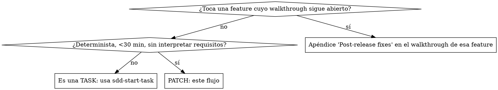

# sdd-start-patch

## Overview

Un **patch** es un fix pequeño y **determinista** (sin interpretación de requisitos), típicamente de menos de 30 minutos. NO pasa por spec → plan → tasks → walkthrough — sería overengineering. Deja constancia legible y portable en un único `patch.md`.

> El nombre del carril (**patch**) es independiente del tipo de rama git-flow: un patch puede salir como `feature/*` o `hotfix/*` según lo que fije el git-flow del proyecto. El carril describe el *proceso ligero*, no de dónde ramificas.

## ¿Es de verdad un patch?

Que quien reporta "crea saber la causa" NO convierte el bug en determinista: la causa la determina tu investigación, no el reporte.

## Flujo (crea un todo por paso)

1. **Causa raíz OBLIGATORIA** — `superpowers:systematic-debugging` ANTES de proponer el fix. Nada de parchear el síntoma, y nada de implementar la hipótesis del reporte sin confirmarla con evidencia en el código. Si la investigación revela que la causa exige interpretar requisitos, o el fix crece más allá de lo puntual → STOP: era una task, cambia a `sdd-start-task`.
2. **Carpeta** — `.docs/sdd/specs/<yyyyMMdd-HHmmss>-patch-<id>-<slug>/` (timestamp UTC: `Get-Date -AsUTC -Format 'yyyyMMdd-HHmmss'`; `<id>` según el modo de `.docs/sdd/sdd-kit.json` (`ids.mode`; sin campo ⇒ `tracker`): en `tracker`, el ticket y `0000` si no hay; en `sequence`, el id reservado en la fila del roadmap, o el que devuelve `Get-NextSddId.ps1` si no tiene fila — comparte secuencia con las tasks y nunca reutiliza un id entre carriles (detalle en `sdd-start-task/references/nombrado.md`)). Los artefactos viven SOLO ahí: no existe `.docs/sdd/patches/` ni ninguna otra ubicación, por ordenada que parezca.
3. **`patch.md`** — calcando `patch-template.md` del skill `sdd-templates`: síntoma (lo reportado, literal), causa raíz (lo que TÚ encontraste, con la evidencia), fix, verificación, tiempo.
4. **Fix mínimo** — sin refactor oportunista, aunque la deuda esté a un renglón de distancia. Verificar que el build del proyecto pasa.
5. **Commit** — convención de commits del proyecto, referenciando el ticket.
6. **Cierre** — `sdd-end-patch`.

## Red flags — STOP

- Estás implementando la hipótesis de quien reporta sin haberla confirmado en el código.
- Vas a crear el documento fuera de `.docs/sdd/specs/` o en una carpeta sin prefijo `patch-`.
- El "fix" ya toca varios módulos o interpreta requisitos → era una task.
- `patch.md` sin causa raíz con evidencia, o con el tiempo en blanco.

| Racionalización | Realidad |
| --- | --- |
| "Operaciones ya sabe la causa" | El reporte describe el síntoma. La causa la determina tu investigación con evidencia en el código. |
| "Es un fix de una línea, no hace falta documento" | Una línea sin rastro es una regresión esperando repetirse. El `patch.md` cuesta 2 minutos. |
| "No quiero abrir una tarea entera" | Correcto: patch ≠ tarea entera. Pero patch ≠ sin proceso: causa raíz + `patch.md` + cierre. |
| "Lo pongo en `.docs/sdd/patches/`, queda más ordenado" | Una segunda ubicación es deriva instantánea. SOLO `.docs/sdd/specs/`. |
